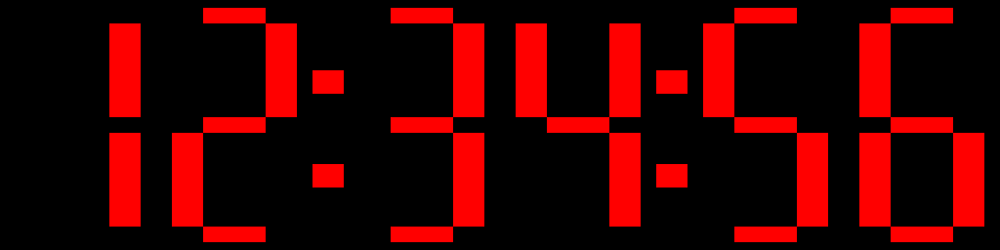
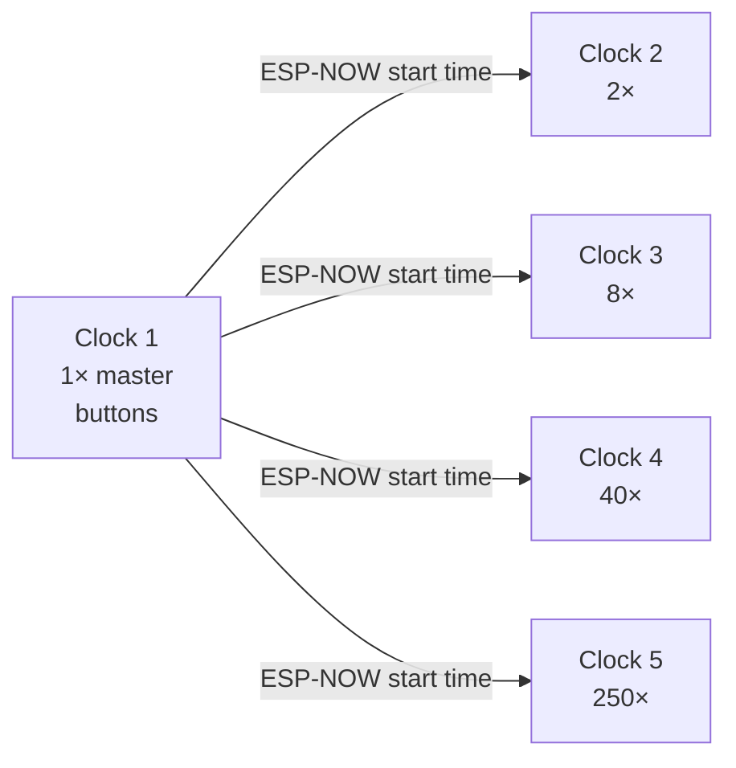

# N:OW

**Five clocks share one starting time, then experience time at five different speeds.**

N:OW is an ESP32-S3 and HUB75 firmware project created for an art installation for [matteomandelli.com](https://matteomandelli.com/). The installation consists of five red `HH:MM:SS` clocks. Clock 1 runs in real time and acts as the master; Clocks 2–5 accelerate the same starting time by progressively larger factors.



## The five clocks

| Clock | Speed | Controls | ESP-NOW role |
|---:|---:|---|---|
| 1 | 1× | Hour and minute buttons | Master |
| 2 | 2× | None | Receiver |
| 3 | 8× | None | Receiver |
| 4 | 40× | None | Receiver |
| 5 | 250× | None | Receiver |

Clock 1 broadcasts the confirmed `HH:MM:00` value over ESP-NOW. Every powered receiver applies that value once and then continues independently at its own speed. The system does not need a router, Internet access, an SSID, or stored Wi-Fi credentials.



At 250×, one displayed second lasts 4 ms, one displayed minute lasts 240 ms, and a complete 24-hour cycle lasts 5 minutes 45.6 seconds. The timer uses monotonic microsecond time, so missed render frames do not make the accelerated clocks drift from their intended rate.

## Current hardware bill of materials

The quantities below describe the validated two-panel design for the complete five-clock installation.

| Component | Per clock | Total | Notes |
|---|---:|---:|---|
| Waveshare ESP32-S3-DEV-KIT-N16R8-M | 1 | 5 | 16 MB flash, 8 MB PSRAM, headers fitted, onboard antenna |
| SEENGREAT RGB Matrix Adapter Board (E), Rev 2.2 | 1 | 5 | Connects the ESP32-S3 to the HUB75E panel |
| P4 indoor HUB75 RGB panel, 64×32, 256×128 mm, 1/16 scan, 1200 nit | 2 | 10 | Two panels form one 128×32 clock |
| HUB75 ribbon cable | 2 | 10 | One adapter-to-panel cable and one panel-to-panel cable per clock |
| Panel power lead | 2 | 10 | Each panel receives its own 5 V and GND pair from the adapter |
| Regulated 5 V / 8 A power supply | 1 | 5 | Validated at firmware brightness 20/255; use one adequately fused supply per clock |
| USB-C data cable | — | 1 | Used for flashing and serial verification |
| Enclosure, standoffs, strain relief and ventilation | 1 set | 5 sets | Keep conductive parts away from exposed electronics |

Master-clock-only parts:

| Component | Quantity | Notes |
|---|---:|---|
| Momentary normally-open SPST pushbutton | 2 | One for hours and one for minutes; prewired panel-mount buttons are convenient |
| Hookup wire and heat-shrink tubing | As required | Both button ground wires may share the same ESP32/SEENGREAT GND |

Connect `SEENGREAT HUB75 → panel 1 IN`, then `panel 1 OUT → panel 2 IN`. Both panels must face the same direction. Power the two modules separately from the adapter's two 5 V/GND outputs; do not pass panel power through the HUB75 ribbon.

## Button behavior

Buttons exist only on Clock 1 and use the ESP32-S3 internal pull-ups:

```text
GPIO10 ── HOURS button ── GND
GPIO11 ─ MINUTES button ─ GND
```

- A short press increments the selected field once.
- Holding a button starts repeat after 800 ms, repeats every 180 ms, then accelerates to every 90 ms after 2 seconds.
- Hours wrap from `23` to `00`; minutes wrap from `59` to `00` without carrying the hour.
- Any setting input resets seconds to `00`.
- After both buttons are released, the selected time flashes for 6 seconds.
- A new press cancels and restarts confirmation.
- At confirmation, Clock 1 begins counting and broadcasts the selected time 20 times over approximately 2 seconds.

Four-pin tactile switches connect the two pins on each physical side internally. Use one pin from each opposite side, and check continuity with a multimeter before applying power.

## Display

- Physical layout: two chained `64 × 32` P4 modules
- Effective resolution: `128 × 32`
- Content: red `HH:MM:SS` on one line
- Glyph style: custom seven-segment digits
- Active drawing area: 124 × 30 pixels
- Brightness: 20/255 in the verified prototype configuration
- Rendering: HUB75 DMA with double buffering
- Panel timing: negative clock phase, required to remove intermittent edge pixels on the tested modules
- Color routing: panel-specific RGB pin order validated on the 1200-nit P4 modules
- Time domain: 24 hours, wrapping from `23:59:59` to `00:00:00`
- Persistence: volatile; every power cycle starts at `00:00:00` until Clock 1 is set

## Software requirements

- Arduino IDE or Arduino CLI
- Espressif ESP32 Arduino core `3.3.12`
- `ESP32 HUB75 LED MATRIX PANEL DMA Display` library `3.0.14`
- Board target: `ESP32S3 Dev Module`
- Flash: 16 MB
- PSRAM: OPI
- USB CDC on boot: enabled
- Upload speed: 115200

The full board identifier used by the build script is:

```text
esp32:esp32:esp32s3:CDCOnBoot=cdc,FlashSize=16M,PartitionScheme=app3M_fat9M_16MB,PSRAM=opi,UploadSpeed=115200
```

## Build all five profiles

From PowerShell, with `arduino-cli` available either on `PATH` or through a standard Arduino IDE WinGet installation:

```powershell
./extras/build-all-clocks.ps1
```

The script creates one isolated build per profile under the ignored `build-profiles/` directory and writes a SHA-256 manifest. Compiled firmware, local logs, serial-port selections and build caches are intentionally excluded from Git.

The script stages the Arduino sketch under the required `NOW_Timer` directory name, so it works regardless of the name or location of the Git clone. Profile 1 remains the source default when no build property is supplied.

## Run the host tests

On Windows with Visual Studio C++ Build Tools installed:

```powershell
./extras/tests/run-tests.cmd
```

The native suite currently contains 164 checks covering profile speeds, the 24-hour cycle, button debounce and repeat timing, setting confirmation, ESP-NOW packet validation and deduplication, synchronization, and the exact 128×32 raster bounds.

## Verification status

| Check | Status |
|---|---|
| 164 native C++ checks | Passed |
| All five ESP32-S3 profiles compile | Passed |
| Distinct firmware hashes for all profiles | Passed |
| Clock 1 flash verification and serial boot | Passed |
| Two chained 64×32 P4 panels | Tested on the prototype |
| Red color routing and negative clock phase | Tested on the prototype |
| Physical master buttons | Pending final wiring test |
| Physical ESP-NOW synchronization between boards | Pending arrival of the receiver boards |

See [Firmware profiles](docs/FIRMWARE_PROFILES.md), [Technical design](docs/PROJECT.md), and [Verification record](docs/VERIFICATION.md) for more detail.

## Safe flashing and wiring

Disconnect the external 5 V supply, HUB75 ribbon and panel power before flashing an ESP32 over USB. Remove USB power as well before changing any wiring. Verify GPIO labels, common ground, polarity and button continuity with a multimeter before reconnecting power.

## Project structure

```text
NOW_Timer.ino                Hardware setup, render loop and profile integration
ClockProfile.h               Five compile-time clock profiles
TimerLogic.h                 Accelerated 24-hour time conversion
TimerController.h            Running, setting, blinking and synchronization state
ButtonInputs.h               Debounce and press-repeat handling
TimerFace.h                  Shared seven-segment renderer
TimeSyncProtocol.h           Validated ESP-NOW packet format and deduplication
TimeSyncRadio.h              ESP-NOW broadcast and receive transport
extras/tests/                Native C++ verification suite
extras/build-all-clocks.ps1  Reproducible five-profile build script
docs/                        Technical and verification documentation
```

## Credit

Created for an art installation for [matteomandelli.com](https://matteomandelli.com/).
